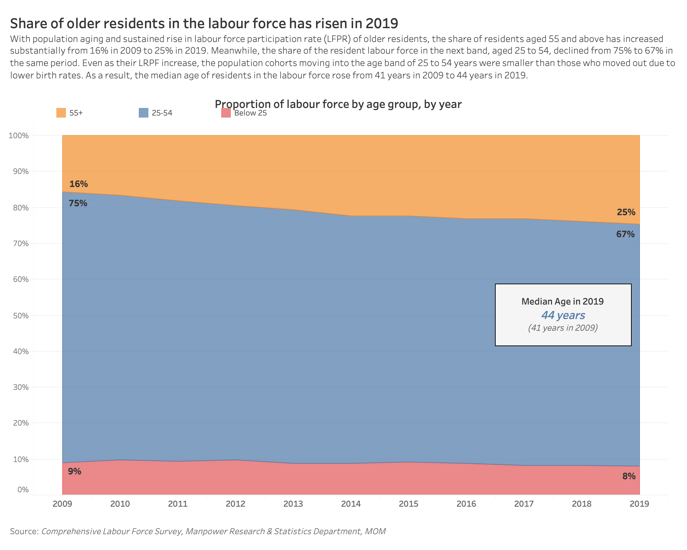

```{r setup, include=FALSE}
knitr::opts_chunk$set(echo = FALSE)
```

# A. Critic

*A critic of the following data visualization is provided.*

](images/00.jpg){width="300"}

### Clarity

-   C1. Trends in the first four sentences of the statement are not apparent in the visualization. In particular, the age groups *aged 55 and above* and *aged 25 to 54* are not clearly shown in the visualization.
-   C2. The years in between 2009 and 2019 are missed out; only 2009 and 2019 are shown.
-   C3. Y-axis is missing from the visualization.
-   C4. No lead in or callouts to provide context.
-   C5. Title and caption of visualization is misleading; *Per Cent* is inaccurate.
-   C6. *LFPR* is used in the statement, without stating what LFPR stands for.
-   C7. *LFPR* trends are not shown in the chart.

### Aesthetics

-   A1. Poor color choice of gray and blue used.
-   A2. Y-axis labels are cramped.
-   A3. Poor positioning of *Source* and *Note*, with less than one line space between them and no spacing below *Note*.

In this hands-on exercise, you will learn how to plot data visualisation for visualising correlation matrix with R. It consists of three main sections. First, you will learn how to create correlation matrix using [*pairs()*](https://www.rdocumentation.org/packages/graphics/versions/3.6.0/topics/pairs) of R Graphics. Next, you will learn how to plot corrgram using **corrplot** package of R Lastly, you will learn how to create an interactive correlation matrix using plotly R. .

# B. Alternative Graphical Representation - Sketch

With reference to [A. Critic], an alternative representation is sketched below.

*insert sketch here*

a.  Two charts, with chart title, are added. (**C5**)

    Chart 1: *Labour force participation rate*

    Chart 2: *Proportion of labour force*

b.  In both charts, data points range every year from 2009 to 2019 (instead of showing only 2009 and 2019). (**C4**)

c.  Data is grouped into three and four age groups in Chart 1 and Chart 2 respectively. (**C1**)

d.  Chart 1 is a line chart that shows the labour force participation rate (LFPR) by age group by year. This will reflect the trends in LFPR, in particular the sustained increase in LFPR for the cohorts aged 55 and above. (**C1, C7**)

    -   *65 and above*

    -   *55 - 64 years*

    -   *25 - 54 years*

    -   *15 - 24 years*

e.  Chart 2 is an area chart that shows three age groups and their proportion of the labour force each year. This chart serves to reflect the increase in proportion of residents aged 55 and over in the labour force over the years. The values for 2009 and 2019, for each age group, are shown. (**C1**)

    -   *55+ years*

    -   *25 to 54 years*

    -   *Below 25 years*

f.  Each line and area is clearly labelled. (**C1, C2**)

g.  Colour palette, *Tableau 10*, is chosen to differentiate the age groups clearly; instead of grey-blue colour for 2009 and 2019 respectively. (**A1**)

h.  Y-axis with minimum 0% and maximum 100% are shown on both charts. (**C3**)

i.  X-axis labels and x-axis title, are comfortably spaced i.e. not cramped on both charts. (**A2**)

j.  *Source* is positioned two line spaces below the x-axes; *Source* is also aligned left and in different front from x-axis labels (for differentiation). (**A3**)

k.  Callouts for percentage in 2009 and 2019, for all three age groups, are added to emphasis the trend as described in the statement. (**C1, C4**)

l.  Labour force participating rate is stated in the statement to reflect what LFPR stands for. (**C6**)

m.  Median age in 2019 and 2009 are shown in a callout on Chart 2. (**C1**)

Next, you will use the code chunk below to install and launch **corrplot**, **ggpubr**, **plotly** and **tidyverse** in RStudio.

```{r, echo=TRUE, eval=TRUE, message=FALSE, warning=FALSE}

packages = c('ggpubr', 'tidyverse')

for(p in packages){library
  if(!require(p, character.only = T)){
    install.packages(p)
  }
  library(p, character.only = T)
}
```

# C. Proposed Data Visualization - Tableau

{width="500"}

# D. Step-by-Step Guide for Creating the Visualization

### D.1 Preparing the data: excel file

a.  First, we download *Table (7): Resident Labour Force Aged Fifteen Years and Over by Age and sex, 2009 -- 2019 (June)* from [Table: Labour Force 2019](https://stats.mom.gov.sg/Pages/Labour-Force-Tables2019.aspx).

b.  Then, we need to calculate **proportion of resident labour force of each age group, by year**, in percent.

    <div>

    > Proportion = **number of residents in each age group each year** divided by **the total number of residents in the same year**
    >
    > {width="250"}

    </div>

c.  Do the same for every year and every age group.

d.  Copy and paste the values calculated onto another excel file. Save file as **data.xlsx** to use as your data source for Tableau. You should have the following three columns with 133 observations.

    <div>

    > Column A: **Year**
    >
    > Column B: **Age (Years)**
    >
    > Column C: **Percentage**
    >
    > {width="250"}

    </div>

### D.2 Creating the visualization on Tableau

a.  Load Tableau and click on *Microsoft Excel* from the taskbar on the left. Select the file: *data.xlsx* that you have created previously. Click **Open**.

b.  Click on *Abc* of Year. From the dropdown, select **Date**.

    {width="400"}

c.  Go to *Sheet 1* from the tabs at the bottom of your window. In the *Data* pane, right-click *Age (Years)* and select **Create \> Group**.

    {width="400"}

d.  In the Create Group dialog box, select the age groups 55 and above, then click **Group**. Rename the group to *55+ years*. Do the same for the other two groups - *25-54 years* and *Below 25 years.*

    {width="400"}

e.  

First, let us import the data into R by using *read_csv()* of **readr** package.

Notice that beside quality and type, the rest of the variables are numerical and continuous data type.

# E. Three Major Observations

1.  Proportion of labour force aged 55 and above is increasing or remain the same every year from 2009 to 2019.
2.  asdfhjkl
3.  asdfhjkl
