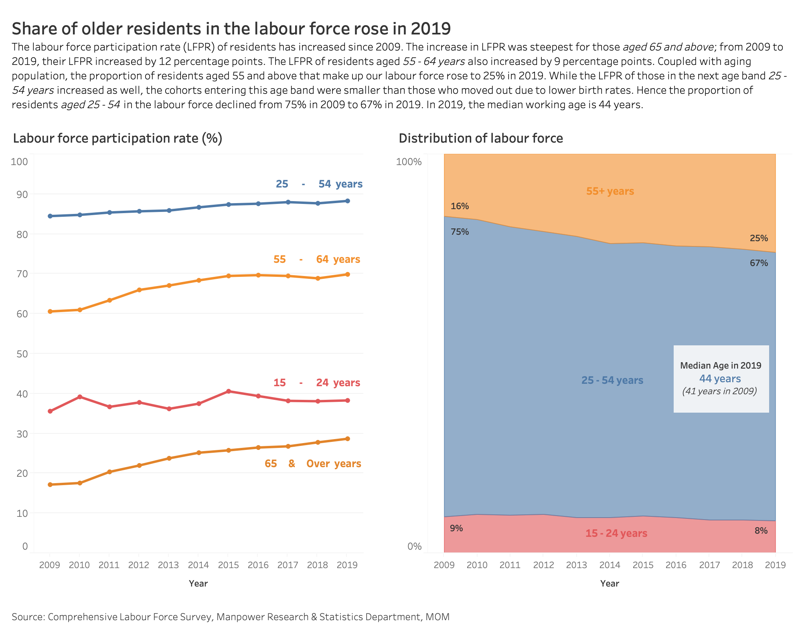

```{r setup, include=FALSE}
knitr::opts_chunk$set(echo = FALSE)
```

# A. Critic

*A critic of the following data visualization is provided.*

](images/00.jpg){width="300"}

### Clarity

-   C1. Trends in the first four sentences of the statement are not apparent in the visualization. In particular, the age groups *aged 55 and above* and *aged 25 to 54* are not clearly shown in the visualization.
-   C2. The years in between 2009 and 2019 are missed out; only 2009 and 2019 are shown.
-   C3. Y-axis is missing from the visualization.
-   C4. No lead in or callouts to provide context.
-   C5. Title and caption of visualization is misleading; *Per Cent* is inaccurate.
-   C6. *LFPR* is used in the statement, without stating what LFPR stands for.
-   C7. *LFPR* trends are not shown in the chart.

### Aesthetics

-   A1. Poor color choice of gray and blue used.
-   A2. Y-axis labels are cramped.
-   A3. Poor positioning of *Source* and *Note*, with less than one line space between them and no spacing below *Note*.

In this hands-on exercise, you will learn how to plot data visualisation for visualising correlation matrix with R. It consists of three main sections. First, you will learn how to create correlation matrix using [*pairs()*](https://www.rdocumentation.org/packages/graphics/versions/3.6.0/topics/pairs) of R Graphics. Next, you will learn how to plot corrgram using **corrplot** package of R Lastly, you will learn how to create an interactive correlation matrix using plotly R. .

# B. Alternative Graphical Representation - Sketch

With reference to [A. Critic], an alternative representation is sketched below.

*insert sketch here*

a.  Two charts, with chart title, are added. (**C5**)

    Chart 1: *Labour force participation rate (%)*

    Chart 2: *Distribution of labour force*

b.  In both charts, data points range every year from 2009 to 2019 (instead of showing only 2009 and 2019). (**C4**)

c.  Data is grouped into three and four age groups in Chart 1 and Chart 2 respectively. (**C1**)

d.  Chart 1 is a line chart that shows the labour force participation rate (LFPR) by age group by year. This will reflect the trends in LFPR, in particular the sustained increase in LFPR for the cohorts aged 55 and above. (**C1, C7**)

    -   *65 and above years*

    -   *55 - 64 years*

    -   *25 - 54 years*

    -   *15 - 24 years*

e.  Chart 2 is an area chart that shows three age groups and their proportion of the labour force each year. This chart serves to reflect the increase in proportion of residents aged 55 and over in the labour force over the years. (**C1**)

    -   *55+ years*

    -   *25 - 54 years*

    -   *15 - 24 years*

f.  In Chart 2, the values for proportion of labour force of each age group, in 2009 and 2019, are labelled to emphasis the trend as described in the statement. (**C1,C4**)

g.  Each line and area is clearly labelled. (**C1, C2**)

h.  Colour palette, *Tableau 10*, is chosen to differentiate the age groups clearly; instead of grey-blue colour for 2009 and 2019 respectively. (**A1**)

i.  Y-axis with minimum 0% and maximum 100% are shown on both charts. (**C3**)

j.  X-axis labels and x-axis title, are comfortably spaced i.e. not cramped on both charts. (**A2**)

k.  *Source* is positioned two line spaces below the x-axes; *Source* is also aligned left and in different front from x-axis labels (for differentiation). (**A3**)

l.  Labour force participating rate is stated in the statement to reflect what LFPR stands for. (**C6**)

m.  Median working age in 2019 and 2009 are shown in a callout on Chart 2. (**C1**)

# C. Proposed Data Visualization - Tableau

insert tableau visualization here

# D. Step-by-Step Guide for Creating the Visualization

### D.1 Preparing the data in excel

a.  First, we download the following two tables from [Table: Labour Force 2019](https://stats.mom.gov.sg/Pages/Labour-Force-Tables2019.aspx).

    -   *Table (5): Resident Labour Force Participation Rate by Age and Sex, 2009 - 2019 (June)*

    -   *Table (7): Resident Labour Force Aged Fifteen Years and Over by Age and Sex, 2009 -- 2019 (June)*

b.  From the data in Table 5, copy and paste the labour force participation rates of the following age groups, from years 2009 to 2019, onto another excel file. You should have three columns with 44 observations. Save file as **data_LFPR.xlsx** to use as your data source for Tableau.

    [Age Groups]{.ul}

    1.  15 - 24

    2.  25 - 54

    3.  55 - 64

    4.  65 & Over

    [Data Columns]{.ul}

    1.  Column A: **Year**

    2.  Column B: **Age Group**

    3.  Column C: **Labour Force Participation Rate**

        {width="250"}

c.  From the data in Table 7, we need to calculate **proportion of resident labour force of each age group, by year**, in percent.

    <div>

    > Proportion = **number of residents in each age group each year** divided by **the total number of residents in the same year**
    >
    > {width="250"}

    </div>

d.  Do the same for every year and every age group. Copy and paste the values calculated onto another excel file. You should have the following three columns with 133 observations. Save file as **data_labour_force.xlsx** to use as your data source for Tableau

    [Data Columns]{.ul}

    1.  Column A: **Year**

    2.  Column B: **Age (Years)**

    3.  Column C: **Percentage** (*i.e. the proportion of resident labour force of each age group in each year)*

        {width="250"}

### D.2 Creating the line chart on Tableau

a.  Load Tableau and click on *Microsoft Excel* from the taskbar on the left. Select the file: *data_lfpr.xlsx* that you have created previously. Click **Open**.

b.  Click on *Abc* of Year. From the dropdown, select **Date**. Then, go to **Sheet 1**.

    {width="250"}

c.  From the *Data* pane, drag **Year** to *Columns*, drag **Labour Force Participation Rate** to *Rows*, and drag **Age Group** to *Color* (in the *Marks* pane).

d.  To show all markers for each line, click on *color* in the *Marks* pane and set *Markers* to **all** i.e. the icon showing a line with markers*.*

    {width="250"}

e.  From Columns*,* click on the dropdown arrow from *YEAR(Year)*and select **Year** as shown in the screenshot below.

    {width="250"}

f.  Double click on the chart title and change it to **Labour force participation rate**. Set font to **Tableau Book, 12, bold**.

g.  Double click on the x-axis and change *Title* from **Year of Year** to **Year**. Go to Tick Marks. Set *Major Tick Marks* to **Fixed**, **Interval = 1**, **Unit = Years**.

    {width="250"}

h.  Double click on the y-axis and remove the *Title*. Set *Range* to **Fixed start = 0**, **Fixed end = 100**.

i.  Right click the y-axis and select **Format**. On the left pane, go to Scale \> Numbers and select **Number(Custom)**. Set *decimal places* to **0** and *suffix* to **%**.

    {width="250"}

j.  To label each line with the age group, drag **Age Group** from the *Data* pane to *Label* in the *Marks* pane. In the *Marks* pane, click on *Label* and update the following attributes.

    1.  Text: **\<Age Group\> years**

    2.  Font: **Tableau Bold, 10pt,** Match Mark Color

k.  From the legend, click the drop-down arrow and go to **EditColors**. Set the colors of each age group according to the screenshot below. The color for *65 & Over* is a darker shade from the color for *55 - 64*. Click **OK**.

    {width="250"}

l.  From the legend, click the drop-down arrow and select **HideCard**.

m.  Rename the sheet from Sheet1 to **LFPR**.

The line chart: *Labour Force Participation Rate* is ready.

{width="600"}

### D.3 Creating the stacked area chart on Tableau

a.  Create a new Worksheet in the same Tableau file. Using the top menu bar, select **Data** \> **New Data Source**. Connect to **data_labour_force.xlsx**.

b.  Click on *Abc* of Year. From the dropdown, select **Date**.

c.  Go to *Sheet 2* from the tabs at the bottom of your window. In the *Data* pane, right-click *Age (Years)* and select **Create \> Group**.

    {width="250"}

d.  In the Create Group dialog box, select the age groups 55 and above, then click **Group**. Rename the group to *55+ years*. Do the same for the other two groups - *25-54 years* and *Below 25 years.*

    > Group naming must be consistent with the line chart in [D.2 Creating the line chart on Tableau].

    {width="250"}

e.  From the *Data* pane, drag **Year** to *Columns*, drag **Percentage** to *Rows*, and drag **Age (Years) (group)** to *Color* (in the *Marks* pane).

f.  From Columns*,* click on the dropdown arrow from *YEAR(Year)*and select **Year** as shown in the screenshot below.

    {width="250"}

g.  From the *Show Me* pane on the right, select **Area chart (continuous)**.

    {width="400"}

h.  Double click on the chart title and change it to **Distribution of labour force**. Set font to **Tableau Book, 12, bold**.

i.  Double click on the x-axis and change *Title* to **Year**. Go to Tick Marks. Set *Major Tick Marks* to **Fixed**, **Interval = 1**, **Unit = Years**.

    {width="164"}

j.  Right click the y-axis and select **Format**. On the left pane, go to Scale \> Numbers and select **Percentage**. Set *decimal places* to **0**.

    {width="250"}

k.  Double click on the y-axis and remove the *Title*. Set *Range* to **Fixed start = 0**, **Fixed end = 1**. Go to *Tick Marks*, select *Major Tick Marks* as **Fixed**, and set **Tick origin = 0**, **Tick interval = 1**.

    {width="250"}

l.  To label each line with the age group, drag **Age (Years) (group)** from the *Data* pane to *Label* in the *Marks* pane. In the *Marks* pane, click on *Label* and update the following attributes.

    1.  Text: **\<Age Group\> years**

    2.  Font: **Tableau Bold, 10pt,** Match Mark Color

m.  In the *Marks* pane, click on the drop down error for **Color**: *Age (Years) (group).* Go to Sort. Select Sort by = **Data Source order** and Sort Order = **Descending**.

    {width="250"}

n.  From the legend, click the drop-down arrow and go to **EditColors**. Set the colors of each age group according to the screenshot below. Click **OK**.

    > The color chosen for each age group must be consistent with the line chart in [D.2 Creating the line chart on Tableau].

    {width="250"}

o.  On the area chart, right click on the data point: **55+ years**, **2009**, **16%**. Select **Annotate \> Mark**. In the Edit Annotation dialog box, type **\<SUM(Percentage)\>**. Change font size to **8**.

    {width="250"}

p.  An annotation showing **16%** will appear on the area chart. Resize the annotation area to its smallest width by dragging the green box. On the *Format Annotation* pane (left), set **Shading = None**, **Line = None**.

    {width="250"}

q.  Create the same annotation for 2009 and 2019 data points. There should be six annotations in total - two each for 3 age groups. Drag each annotation in place, as shown in the screenshot below.

    {width="250"}

r.  From the legend, click the drop-down arrow and select **HideCard**.

s.  Rename the sheet from Sheet2 to **Labour Force**.

The area chart: *Distribution of labour force* is ready.

{width="400"}

### D.3 Creating the dashboard on Tableau

a.  Create a **NewDashboard** in the same Tableau file.

b.  From the *Dashboard* pane, drag **LFPR** to the canvas. Then, drag **Labour Force** to the right half of the canvas.

c.  From the *Objects* pane, drag and drop text box to the top of the canvas (above both charts). A box spanning the entire width of the canvas must appear before you release your cursor.

d.  An Edit Text dialog box appears. Place your title and description in the box. Update their fonts accordingly.

    -   Title: **Tableau Light, 16, bold**

        > Share of older residents in the labour force has risen in 2019

    -   Description: **Tableau Light, 10**, *not bold*

        > The labour force participation rate (LFPR) of older residents has been increasing since 2009. In particular, the age group with the greatest increase in LFPR is residents aged 65 and above; their LFPR increased by 12 percentage points from 17% in 2009 to 29% in 2019. Coupled with aging population, the proportion of residents aged 55 and above that make up our labour force increased to 25% in 2019. While the LFPR of those aged 25 - 54 years increased as well, the cohorts entering this age band were smaller than those who moved out due to lower birth rates. Hence the proportion of residents aged 25 - 54 in the labour force fell from 75% in 2009 to 67% in 2019. In 2019, the median working age is 44 years.

    -   For both *Title* and *Description*, font color (as shown below) is the same.

        {width="250"}

e.  From the *Objects* pane, drag and drop **Blank** in between your two charts.

f.  From the *Objects* pane, drag and drop text box to the bottom of the canvas (below both charts). A box spanning the entire width of the canvas must appear before you release your cursor.

g.  An Edit Text dialog box appears. Place the *Source* in the box. Update the font to

    > Source: Comprehensive Labour Force Survey, Manpower Research & Statistics Department, MOM

h.  Resize each pane. Reposition marker annotations and data labels accordingly. The final dashboard is shown below.

{width="600"}

# E. Three Major Observations

1.  Proportion of labour force aged 55 and above is increasing or remain the same every year from 2009 to 2019.
2.  asdfhjkl
3.  asdfhjkl
