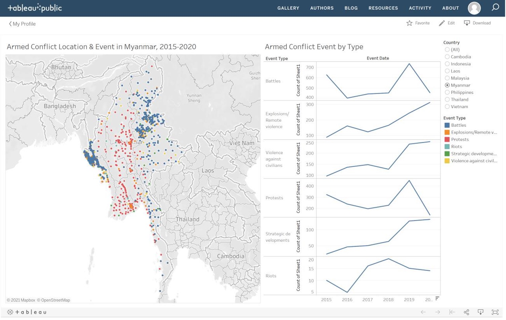
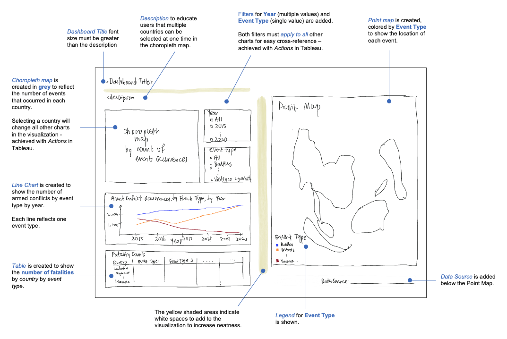
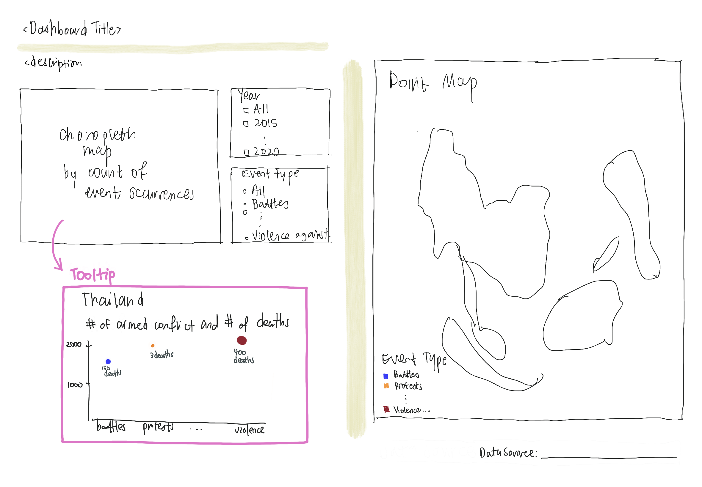
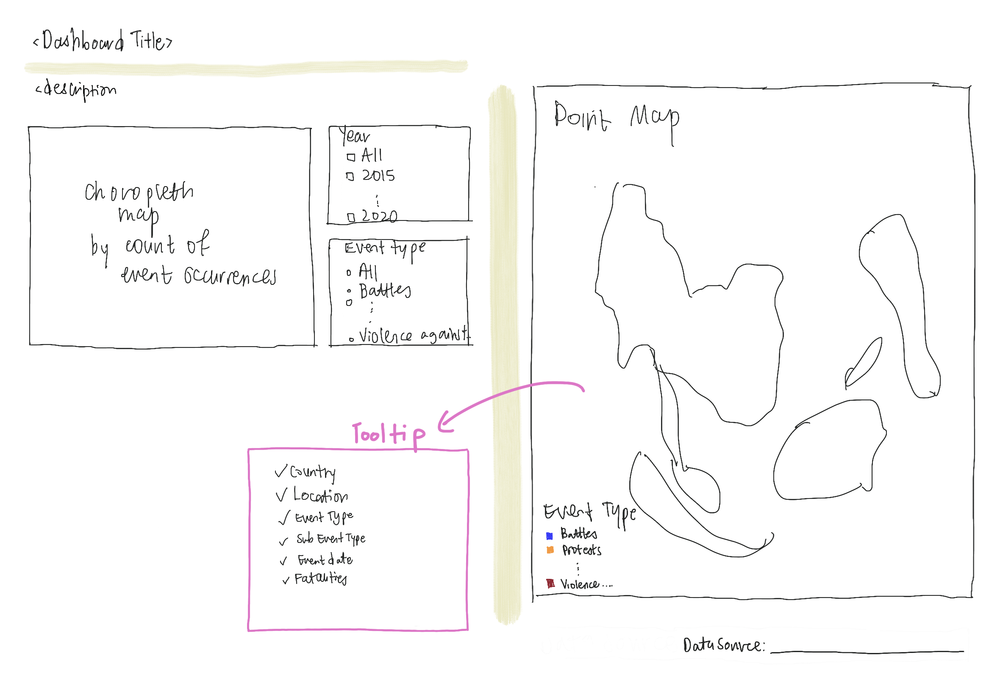
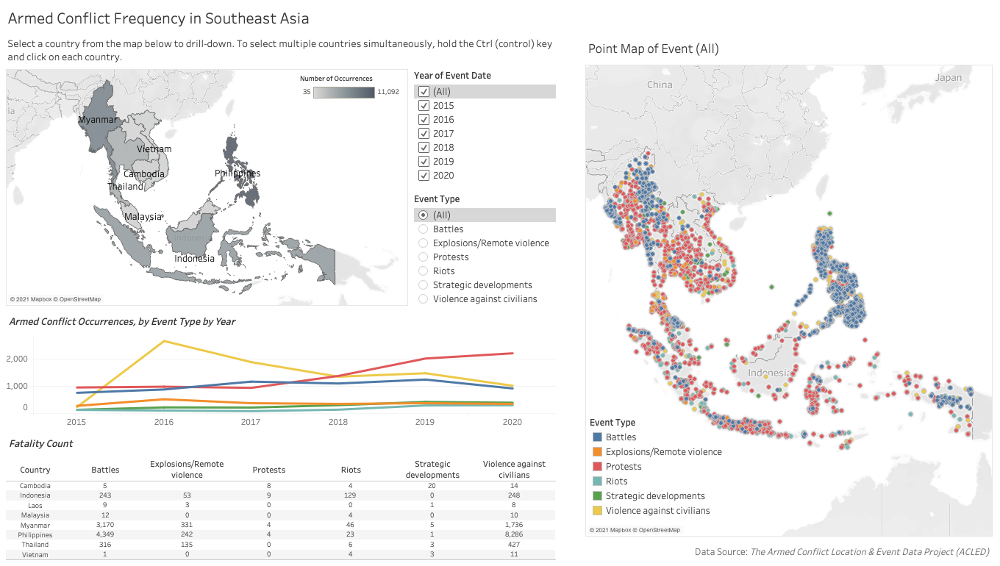
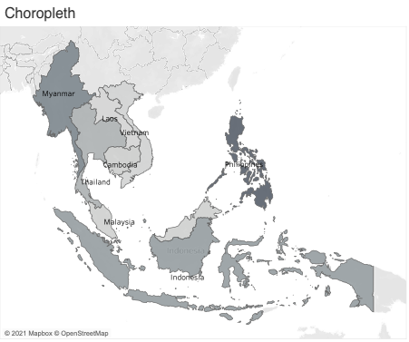

```{r setup, include=FALSE}
knitr::opts_chunk$set(echo = FALSE)
```

# A. Critic

A critic of the following data visualization is provided in terms of clarity and aesthetics.

[{width="80%"}](https://public.tableau.com/profile/tskam#!/vizhome/South-eastAsiaArmedConflictAnalysis/South-eastAsiaArmedConflictAnalysis)

### Clarity

+-----+-----------------------------------------------------------------------------------------------------------------------------------------------------------------------------------------+-------------------------------------------------------------------------------------------------------------------------------------------------------------------------------------------------------------------------------------------------------------------------------------------------------------------------+
| S/N | Critique                                                                                                                                                                                | Suggestion                                                                                                                                                                                                                                                                                                              |
+=====+=========================================================================================================================================================================================+=========================================================================================================================================================================================================================================================================================================================+
| 1   | As the points on the map overlap each other (highlighted below), the map does not clearly show the frequency of events in each region.                                                  | Instead of using a point map, use a **choropleth map** to show the concentration of events in the region.                                                                                                                                                                                                               |
|     |                                                                                                                                                                                         |                                                                                                                                                                                                                                                                                                                         |
|     | {width="80%"}                                                                                                                        | The point map can be retained to show only one type of event instead of all events.                                                                                                                                                                                                                                     |
+-----+-----------------------------------------------------------------------------------------------------------------------------------------------------------------------------------------+-------------------------------------------------------------------------------------------------------------------------------------------------------------------------------------------------------------------------------------------------------------------------------------------------------------------------+
| 2   | The dashboard is lacking the **Event Date** filter to allow users to select the event date period they are interested to view.                                                          | Create a filter for users to select the year (multiple values) they are interested to view.                                                                                                                                                                                                                             |
+-----+-----------------------------------------------------------------------------------------------------------------------------------------------------------------------------------------+-------------------------------------------------------------------------------------------------------------------------------------------------------------------------------------------------------------------------------------------------------------------------------------------------------------------------+
| 3   | The dashboard is lacking the **Event Type** filter to allow users to select the event type to show on the charts.                                                                       | Create a filter for users to select the event type (single) value they are interested to view. This filter must also act on the point map.                                                                                                                                                                              |
+-----+-----------------------------------------------------------------------------------------------------------------------------------------------------------------------------------------+-------------------------------------------------------------------------------------------------------------------------------------------------------------------------------------------------------------------------------------------------------------------------------------------------------------------------+
| 4   | The y-axis tick marks are of varying scale for *Armed Conflict Event by Type*. Should the user miss to notice this, the user will be comparing the event counts and trends incorrectly. | Create one line chart for *Armed Conflict Occurrences, by Event Type by Year*. Each event type will be a line (series). Ensure the lines are colored according to the legend of the choropleth map. All the event types will be on the same y-axis for easy comparison; there will only be 1 panel instead of 6 panels. |
|     |                                                                                                                                                                                         |                                                                                                                                                                                                                                                                                                                         |
|     | {width="65%"}                                                                                                                                       |                                                                                                                                                                                                                                                                                                                         |
+-----+-----------------------------------------------------------------------------------------------------------------------------------------------------------------------------------------+-------------------------------------------------------------------------------------------------------------------------------------------------------------------------------------------------------------------------------------------------------------------------------------------------------------------------+

### Aesthetics

+-----+---------------------------------------------------------------------------------------------------------------------------------------------------------------------+--------------------------------------------------------------------------------------------------------------------------------------------+
| S/N | Critique                                                                                                                                                            | Suggestion                                                                                                                                 |
+=====+=====================================================================================================================================================================+============================================================================================================================================+
| 1   | The y-axis title of the line charts read "Count of Sheet1" when users do not know what Sheet1 is.                                                                   | Rename the y-axis title to "Count" or remove the y-axis title entirely if count of events is clearly stated elsewhere (e.g. in the title). |
|     |                                                                                                                                                                     |                                                                                                                                            |
|     | {width="80%"}                                                                                                  |                                                                                                                                            |
+-----+---------------------------------------------------------------------------------------------------------------------------------------------------------------------+--------------------------------------------------------------------------------------------------------------------------------------------+
| 2   | The map and line chart has no blank space between each other, causing the visualization to look cramped.                                                            | Insert blank spaces between the map and the line chart.                                                                                    |
|     |                                                                                                                                                                     |                                                                                                                                            |
|     | {width="80%"}                                                                                                                       |                                                                                                                                            |
+-----+---------------------------------------------------------------------------------------------------------------------------------------------------------------------+--------------------------------------------------------------------------------------------------------------------------------------------+
| 3   | The lines in the line chart are colored blue for all Event Types. This is misleading since the same blue color is used to represent Event Type: Battles in the map. | The lines in the line chart should follow the legend (colors) for Event Type used in the map. This creates consistency for the readers.    |
|     |                                                                                                                                                                     |                                                                                                                                            |
|     | {width="80%"}                                                                                                                        |                                                                                                                                            |
+-----+---------------------------------------------------------------------------------------------------------------------------------------------------------------------+--------------------------------------------------------------------------------------------------------------------------------------------+
| 4   | Event Type labels are *wrapped* while the text for the legend is not.                                                                                               | Ensure that text is wrapped so that the entire text is shown on the visualization instead of "...".                                        |
|     |                                                                                                                                                                     |                                                                                                                                            |
|     | {width="80%"}                                                                                                                     |                                                                                                                                            |
+-----+---------------------------------------------------------------------------------------------------------------------------------------------------------------------+--------------------------------------------------------------------------------------------------------------------------------------------+
| 5   | The tooltips for the point map and line chart are neat.                                                                                                             | Retain the neatness of the tooltip. Consider including more details in the tooltip e.g. location, notes of the event.                      |
|     |                                                                                                                                                                     |                                                                                                                                            |
|     | {width="80%"}                                                                                                       |                                                                                                                                            |
|     |                                                                                                                                                                     |                                                                                                                                            |
|     | {width="80%"}                                                                                                      |                                                                                                                                            |
+-----+---------------------------------------------------------------------------------------------------------------------------------------------------------------------+--------------------------------------------------------------------------------------------------------------------------------------------+

# B. Proposed Sketch



The tooltips for the visualization can be enhanced further.

{width="60%"}

{width="60%"}

# C. Proposed Dashboard

Available [here](https://public.tableau.com/views/dataviz_makeover_3_16163176803610/ArmedConflictFrequencyinSoutheastAsia?:language=en&:display_count=y&publish=yes&:origin=viz_share_link) on Tableau Public.

{width="100%"}

# D. Step by Step Guide

### Preparing the data

1.  Create a unique event ID for each observation in the data by first creating a new column titled "Event_ID_UNIQUE" to the left of ISO.

2.  Insert the formula **=F2&"\_"&C2** into Cell A2.

    EVENT_ID_CNTY *is an individual identifier by number and country acronym that is updated annually, hence* EVENT_ID_CNTY *is concatenated with* Year *to result in a unique event ID across all years and all countries. This field is named* Event_ID_UNIQUE*.*

    {width="80%"}

3.  Then, hover your cursor to the bottom right corner of cell A2. When a black cross appears, double-click on the black-cross. This will fill all the cells below Cell A2, up to the last observation.

4.  Next, right-click on Column A. Select **Copy**.

    {width="50%"}

5.  Then, right-click-on Column A again. Select **Paste Special** \> **Values**.

    {width="50%"}

6.  Once the above is completed, save your file as **data.xlsx** (Microsoft Excel file format).

    We will be using **EVENT_ID_UNIQUE** to count the number of events for our data visualization on Tableau.

7.  Go to Tableau, connect to the Microsoft Excel file: **data.xlsx**.

    {width="20%"}

8.  Go to Data \> Edit Data Source Filters.

    {width="80%"}

    Click **Add**. Select **Event Date**.

    {width="80%"}

    Select **Years**.

    {width="40%"}

    Tick years **2015 to 2020**. Then press **OK**.

    {width="45%"}

9.  Go to File \> Save As, save the Tableau workbook as **dataviz3**.

    {width="80%"}

### Creating the **choropleth** map

1.  Right click **Sheet1**, select **Rename**. Rename the sheet to "Choropleth".

    {width="80%"}

2.  From the *Data* pane, drag **Longtitude** to *Columns* and **Latitude** to *Rows*.

    {width="80%"}

3.  From the *Data* pane, drag **Event ID UNIQUE** to the Marks pane: Color.

    {width="40%"}

    Select **Add all members** when the dialogue below appears.

    {width="40%"}

4.  In the *Marks* pane, click on the down arrowhead next to for Event ID UNIQUE. Select Measure \> **Count**.

    {width="50%"}

5.  From the *Data* pane, drag the following to the *Marks* pane.

    -   **Country** to Marks: [Label]{.ul}

    -   **Country** to Marks: [Detail]{.ul}

    -   F**atalities** to Marks: [Tooltip]{.ul}

    The *Marks* pane should look like this.

    {width="20%"}

6.  In the *Marks* pane, change the chart type to **Map**.

    {width="80%"}

7.  In the *Marks* pane, click on **Color** \> **Edit Colors**. Change *Automatic* to **Gray**.

    {width="80%"}

8.  From the *Data* pane, drag **Event Date** to *Filters*.

    {width="40%"}

    Select **Years**.

    {width="40%"}

    Select **All**. Ensure that all the years from 2015 to 2020 are ticked. Then press **OK**.

    {width="40%"}

9.  From the *Data* pane, drag **Country** to *Filters*. Click **All**, then **OK**.

    {width="40%"}

10. From the *Data* pane, drag **Event Type** to *Filters*.

    {width="40%"}

11. Click on the down arrowhead of [YEAR(Event Date)]{.ul} in the *Filters* pane. Go to **Apply to Worksheets** \> **All Using This Data Source**.

    {width="80%"}

12. Repeat Step 11 for [Country]{.ul} and [Event Type]{.ul} in the *Filters* pane.

13. Click on the down arrowhead of [YEAR(Event Date)]{.ul} in the *Filters* pane. Select **Show Filter** by ensuring there is a tick next to **Show Filter**.

    {width="40%"}

14. Repeat Step 13 for [Country]{.ul} and [Event Type]{.ul} in the *Filters* pane.

15. For the filter: **Event Type** shown, click the down arrowhead next to **Event Type**. Select **Single Value (list)**.

    {width="80%"}

    #### Creating *Dot by Event Type* for tooltip

    1.  In the toolbar on the top, go to **Worksheet** \> **New Worksheet**.

        {width="80%"}

    2.  Rename the worksheet to "Dot by Event Type".

        {width="80%"}

    3.  From the *Data* pane, drag **Event Type** to *Columns* and **Event ID UNIQUE** to *Rows*.

        {width="80%"}

    4.  In the *Rows*, click on **Event ID UNIQUE** and go to **Measure (Count)** \> **Count**. Ensure there is a tick next to **Count**.

        {width="80%"}

    5.  From the *Data* pane, drag **Country** to [Color]{.ul} in the *Marks* pane.

    6.  From the *Data* pane, drag **Fatalities** to [Size]{.ul} in the *Marks* pane.

    7.  In the *Marks* pane, change chart type from Automatic to **Circle**.

        {width="40%"}

    8.  From the *Data* pane, drag **Fatalities** to [Label]{.ul} in the *Marks* pane.

    9.  Right click on **Event Type** in the chart. Select **Hide Field Labels for Columns**.

        {width="50%"}

    10. In the *Marks* pane, click on [Label]{.ul}. Click on "**...**" next to **Text**.

        {width="50%"}

        Click on the double headed arrow next to **Alignment**. Select *Top* in the Vertical section.

        {width="50%"}

    11. In the **Edit Label** dialogue box, set Font to **Tableau Book**, size to **8** and color to the fourth shade of gray per screenshot below.

        Add "deaths" to the line below \<SUM(Fatalities)\>.

        "\<SUM(Fatalities)\>" is bold while "deaths" is not bold.

        {width="80%"}

    12. Right click on the x-axis and select **Format**.

        {width="50%"}

    13. In the *Format Event Type* pane, set *Font* size to **8**. Set *Alignment* to Wrap: **On**.

        {width="50%"}

    14. Double click on the y-axis. Remove "Count of Event ID UNIQUE" from the Axis Titles:Title.

        {width="45%"}

    15. In the *Format CNT(Event ID UNIQUE)* pane, go to **Numbers**. Select **Numbers (Standard)**.

        {width="50%"}

    16. From the taskbar, change the Fit to **Fit Width**.

        {width="80%"}

    The *Dot by Event Type* chart should look like this.

    {width="75%"}

16. Go to the worksheet named **Choropleth**. In the *Marks* pane, click on [Tooltip]{.ul}.

    {width="50%"}

17. In the **Edit Tooltip** dialogue box, edit the text to the following.

    > **\<Country\>**
    >
    > **\<CNT(Event ID UNIQUE)\>** armed conflicts and **\<SUM(Fatalities)\> deaths** recorded.\
    >
    > [Number of Armed Conflicts]{.ul}
    >
    > \<Sheet name="Dot by Event Type" maxwidth="500" maxheight="300" filter="\<All Fields\>"\>

    {width="80%"}

    > **\<Country\>**

    Tableau Book, Size 12, Bold\
    Color = black (darkest gray)

    > **\<CNT(Event ID UNIQUE)\>** armed conflicts and **\<SUM(Fatalities)\> deaths** recorded.

    Tableau Book, Size 10\
    Color = black (darkest gray)\
    Only **\<CNT(Event ID UNIQUE)\>** and **\<SUM(Fatalities)\> deaths** are in bold.

    > [Number of Armed Conflicts]{.ul}

    Tableau Book, Size 10, Underlined\
    Color = third-lightest shade of gray

    {width="50%"}

    > \<Sheet name="Dot by Event Type" maxwidth="500" maxheight="300" filter="\<All Fields\>"\>

    Go to **Insert** \> **Sheets** \> **Dot by Event Type**. Edit the maxwidth and maxheight to "500" and "300" respectively.

    {width="80%"}

    The **choropleth** **map** is shown below.

    

    When hovering onto an individual country, the tooltip appears to reflect the number of armed conflicts, number of deaths and the event type for the country. In the screenshot below, Indonesia is shown.

    {width="80%"}

### Creating the point map

1.  In the toolbar on the top, go to **Worksheet** \> **New Worksheet**.

    {width="80%"}

2.  Rename the worksheet to "Point Map".

    {width="80%"}

3.  From the *Data* pane, drag **Longitude** to Columns and **Latitude** to Rows. Next, drag **Event Type** to [Color]{.ul} in the *Marks* pane and **Event ID UNIQUE** to [Detail]{.ul} in the *Marks* pane.

    {width="80%"}

4.  In the *Marks* pane, click on [Size]{.ul}. Reduce the size per screenshot below.

    {width="35%"}

5.  In the *Marks* pane, click on [Color]{.ul}. Go to the dropdown for **Border** and select the gray color as shown in the red box below.

    {width="30%"}

6.  Hold onto **Ctrl** and select the following fields from the *Data* pane. Drag them to [Tooltip]{.ul} in the *Marks* pane.

    > Country, Event Date, Event Type, Location, Notes, Sub Event Type, Fatalities

    {width="40%"}

7.  In the *Marks* pane, click on [Tooltip]{.ul}. In the **Edit Tooltip** dialogue box, remove the irrelevant fields and rearrange the fields accordingly (see screenshot below). Note that \<ATTR(Notes)\> is not bold. Click **OK** to save your tooltip.

    > Country: **\<ATTR(Country)\>**
    >
    > Location: **\<ATTR(Location)\>**
    >
    > Event Type: **\<Event Type\>**
    >
    > Sub Event Type: **\<ATTR(Sub Event Type)\>**
    >
    > Event Date: **\<ATTR(Event Date)\>**
    >
    > Fatalities: **\<SUM(Fatalities)\>**
    >
    > \
    > \<ATTR(Notes)\>

    {width="80%"}

    When hovering onto a point, the tooltip now appears and shows the details of the event at that point.

    {width="80%"}

### Creating the line chart

1.  In the toolbar on the top, go to **Worksheet** \> **New Worksheet**.

    {width="80%"}

2.  Rename the worksheet to "Line by Event Type".

    {width="80%"}

3.  From the *Data* pane, drag **Event Date** to Columns and **Event ID UNIQUE** to Rows. Next, drag **Event Type** to [Color]{.ul} in the *Marks* pane, **Country** to [Tooltip]{.ul} in the *Marks* pane, and **Fatalities** to [Tooltip]{.ul} in the *Marks* pane.

    {width="80%"}

4.  From *Rows*, click on the down arrow next to **Event ID UNIQUE**. Select **Measure** \> **Count**.

    {width="45%"}

5.  Double click on the y-axis. Remove "Count of Event ID UNIQUE" from the Axis Titles:Title.

    {width="40%"}

6.  Right click on the y-axis. Select **Format**.

    {width="45%"}

7.  On the left panel, go to **Font** and change font size to **8**.

    {width="25%"}

8.  Then, go to **Numbers** and select **Number (Standard)**.

    {width="35%"}

9.  Right click on the x-axis. Select **Format**.

10. On the left panel, select **Font** and change font size to **8**.

    {width="25%"}

11. Double-click on the Title of the chart. In the **Edit Title** dialogue box, type the following. Ensure that the font type, size and color is chosen as Tableau Light, 10 and gray (per screenshot). Click **OK**.

    > Armed Conflict Occurrences, by Event Type by Year

    {width="40%"}

12. From the taskbar, change the Fit to **Entire View**.

    {width="40%"}

13. In the *Marks* pane, click on [Tooltip]{.ul}. In the **Edit Tooltip** dialogue box, rearrange the fields accordingly and update the text (see screenshot below). Note that \<Event Type\> is not bold, instead it is italicized. Click **OK** to save your tooltip.

    > **\<CNT(Event ID UNIQUE)\>** *\<Event Type\>* happened in **\<ATTR(Country)\>** in \<YEAR(Event Date)\>.
    >
    > **\<SUM(Fatalities)\>** deaths recorded.

    {width="80%"}

14. Right click on **Event Date**. Select **Hide Field Labels for Columns**.

    {width="45%"}

    The line chart is shown below.

    {width="80%"}

    The tooltip appears when you hover over a point.

    {width="50%"}

### Create table for Fatality Count

1.  In the toolbar on the top, go to **Worksheet** \> **New Worksheet**.

    {width="80%"}

2.  Rename the worksheet to "Fatality Count".

    {width="80%"}

3.  From the *Data* pane, drag **Event Type** to Columns and **Country** to Rows. Next, drag **Fatalities** to [Text]{.ul} in the *Marks* pane.

    {width="80%"}

4.  From the taskbar, change the Fit to **Entire View**.

    {width="60%"}

5.  Right click on **Event Type** in the chart. Select **Hide Field Labels for Columns**.

    {width="45%"}

6.  Double-click on the Title of the chart. In the **Edit Title** dialogue box, highlight \<Sheet Name\>. Update font type, size and color to Tableau Light, 10, Bold and Italicized (per screenshot below). Click **OK**.

    {width="45%"}

7.  In the table, right-click on **Battles**. Select **Format...**.

    {width="40%"}

8.  On the left panel, go to **Font**. Update font to **Tableau Regular** and size to **8**.

    {width="40%"}

9.  In the table, right-click on **Battles**. Select **Format...**.

    {width="40%"}

10. On the left panel, go to **Pane**. Update font to **Tableau Book** and size to **7**.

    {width="40%"}

11. Then go to *Alignment* section. Go to **Pane** \> Horizontal, select [Center]{.ul}.

    {width="40%"}

12. In the table, right-click on **Cambodia**. Select **Format...**.

    {width="40%"}

13. On the left panel, go to **Font**. Update font to **Tableau Book** and size to **7**.

    {width="40%"}

14. Next go to **Alignment** \> Horizontal, select [Center]{.ul}.

    {width="40%"}

15. In the *Marks* pane, click on [Tooltip]{.ul}. In the **Edit Tooltip** dialogue box, update the text to the following. Click **OK**.

    > **\<Country\>** had **\<SUM(Fatalities)\>** deaths from **\<Event Type\>**.

    {width="80%"}

    The table, with tooltip, is shown below.

    {width="60%"}

### Preparing the dashboard

1.  In the toolbar on the top, go to **Dashboard** \> **New Dashboard**.

    {width="80%"}

2.  At the bottom of your window, right-click on *Dashboard 1*. Select **Rename**. Rename the dashboard.

    > Armed Conflict Frequency in Southeast Asia

    {width="50%"}

3.  From the Dashboard pane, tick **show dashboard title**.

    {width="50%"}

4.  Double-click on the dashboard title.

    {width="50%"}

5.  In the **Edit Title** dialogue box, update the font attributes accordingly. Click **OK**.

    > Tableau Book, Size 15, *third* shade of gray

    {width="45%"}

6.  From *Dashboard: Sheets,* drag **Choropleth** to the bottom half of the dashboard.\
    Resize the choropleth map by dragging the top border upwards.

    {width="30%"} {width="30%"} {width="30%"}

7.  From *Dashboard: Sheets*, drag **Point Map** to the right of the dashboard. Release your cursor only when you see the long shaded rectangle below.

    {width="45%"} {width="45%"}

8.  From *Dashboard: Sheets*, drag **Line by Event Type** to the bottom of the choropleth map - you will have to move your cursor to the horizontal scroll bar. Release your cursor only when you see the shaded rectangle below.

    {width="45%"} {width="45%"}

9.  From *Dashboard: Sheets*, drag **Fatality Count** to the bottom of the line chart. Release your cursor only when you see the shaded rectangle below.

    {width="45%"} {width="45%"}

10. For *Fatality Count*, resize (drag) the column headers to ensure that the labels are clearly shown. For instance, "Violence against civilians" should be shown and not "Violence agains...".

    {width="45%"}

    {width="45%"}

11. On the dashboard, right-click on the choropleth map title: *Choropleth* and select **Hide Title**.

    {width="45%"}

12. Select the **Country** filter. Click on the cross to remove the filter from the dashboard.

    {width="80%"}

13. Rearrange the filters such that the filter for **Year of Event Date** is positioned above the filter for **Event Type**.

    {width="40%"} {width="40%"}

14. From the *Dashboard* pane, select Objects: **Text** and drag to the dashboard title. Release your cursor only when you see the shaded rectangle below.

    {width="45%"}

    In the **Edit Text** dialogue box, enter the following.

    > Select a country from the map below to drill-down. To select multiple countries simultaneously, hold the Ctrl (control) key and click on each country.

    Update font to Tableau Book, Size 10 and third shade of gray. Press **OK**.

    {width="45%"}

15. Select the dashboard title. Drag the title to above the text "Select a country...".

    {width="45%"} {width="45%"}

16. Then resize both the title and the text.

    {width="80%"}

17. Right-click on the title: *Point Map*. Change the text to the following. To add \<Event Type\>, go to [Insert]{.ul}, select **ATTR(Event Type)**.

    > \<Sheet Name\> of Event (\<Event Type\>)

    {width="40%"}

18. From the *Dashboard* pane, select Objects: **Blank** and drag to the center of the dashboard. Release your cursor only when you see the shaded rectangle below.

    {width="80%"}

19. Reduce the size of the blank. Refer to the screenshot on the right, below.

    {width="45%"} {width="45%"}

20. Select the legend **Count of Event ID UNIQUE**. Click the down arrowhead and select **Floating**.

    {width="80%"}

21. Double click on the legend title: *Count of Event ID UNIQUE*. In the **Edit Legend Title** dialogue box, change the font size to 7. Update the text to the following.

    > Number of Occurrences

    {width="45%"}

22. Drag the legend to the top right of the choropleth map. Right click on the color scale and select **Format Legend**.

    {width="80%"}

23. In the *Format Legends* pane, go to **Font** and update font size to **7**.

    {width="45%"}

24. Select the legend **Event Type**. Click the down arrowhead and select **Floating**.

    {width="30%"}

25. Move the legend to the bottom left of the point map.

    {width="80%"}

26. Extend the size of the filters *Year of Event Date* and *Event Type* to ensure that no scrolling (horizontal/vertical) is required for both filters.

    {width="80%"}

27. asdf

    {width="80%"}

28. In the toolbar on the top, go to **Dashboard** \> **Actions**.

    {width="80%"}

29. Go to Add Actions, select **Filter**.

    {width="45%"}

30. In the **Add Filter Action** dialogue box, set the *Name* as "Select on Choropleth".

    > For *Source Sheets*, tick only **Choropleth**, leaving the other three un-ticked.\
    > Run action on: **Select**.
    >
    > For *Target Sheets*, tick all sheets.\
    > Clearing the selection will: **Show all values**.

    {width="45%"}

31. Hover your cursor over the point map. Ensure that the map is not fixed i.e. ensure that the pin icon (below) does not have a cross. If there is a cross, click on the pin once to remove the cross.

    {width="80%"}

32. Last but not least, we will add text stating the data source. From the *Dashboard* pane, select Objects: **Text** and drag to the bottom of the point map.

    {width="80%"}

33. In the **Edit Text** dialogue box, update the text to the following.

    > Data Source: *The Armed Conflict Location & Event Data Project (ACLED)*

    Ensure that the font is set to **Tableau Book, size 9**, and the third-shade of gray (in screenshot below). Align the text to the **right**. Note that "*The Armed Conflict Location & Event Data Project (ACLED)*" is italicized.

    {width="45%"}

The dashboard is completed (available [here](https://public.tableau.com/views/dataviz_makeover_3_16163176803610/ArmedConflictFrequencyinSoutheastAsia?:language=en&:display_count=y&publish=yes&:origin=viz_share_link)). You can select a country from the choropleth map, and the other charts will change accordingly.

[{width="100%"}](https://public.tableau.com/views/dataviz_makeover_3_16163176803610/ArmedConflictFrequencyinSoutheastAsia?:language=en&:display_count=y&publish=yes&:origin=viz_share_link)

# E. Main Observations

1.  From 2015 to 2020, **Philippines** has recorded the highest number of armed conflicts at **11,092** occurrences.

    {width="80%"}

    When drilling down by Event Type,

    > **Myanmar** has the highest number of *Battles* and *Explosions/Remote Violence* in the region.

    {width="45%"} {width="45%"}

    > **Indonesia** has the highest number of *Protests* and *Riots* in the region.

    {width="45%"} {width="45%"}

    > **Philippines** has the highest number of *Strategic Developments* and *Violence against civilians* in the region.

    {width="45%"}

2.  *Protests* and *Riots* are on the rise from 2015 to 2020 **in the region**.

    {width="80%"}

    {width="80%"}

3.  In **2020**, **Indonesia** has the highest number of *protests* (1,050), followed by **Thailand** (679).

    {width="80%"}

4.  Despite the emergence of the coronavirus pandemic, **Thailand** faced a [spike]{.ul} of *protests* from 2019 (164) to 2020 (679). Led by high school and university students, the young people are calling for the dissolution of parliament, an end to harassment of government critics and for changes to the military-backed constitution ([Ratcliffe](https://www.theguardian.com/world/2020/sep/22/thailand-protests-everything-you-need-to-know), 2020).

    {width="80%"}

5.  **Violence against civilians** is on the [decrease]{.ul} in the Southeast Asia region since 2016.

    *Year 2015 is excluded because there is no data for Philippines for year 2015.*

    {width="80%"}

    > **Philippines** has the greatest number of violence against civilians (6,621) and related fatalities (8,286), despite the count of violence against civilians decreasing over the years.

    {width="45%"} {width="40%"}

6.  On the contrary, **Myanmar** and **Indonesia** are facing a [rise]{.ul} in **violence against civilians**.

    {width="45%"} {width="45%"}
